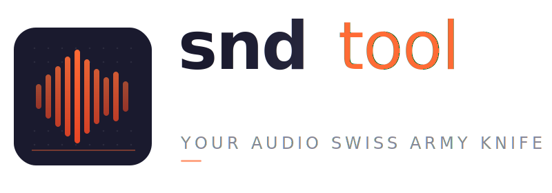

<picture>
  <source media="(prefers-color-scheme: dark)" srcset="sndtool-logo-dark.svg">
  <source media="(prefers-color-scheme: light)" srcset="sndtool-logo.svg">
  
</picture>

A terminal-based audio swiss army knife — browse, tag, merge, and manipulate audio files from the comfort of your terminal.

## Vision

Most audio file management tools are either heavyweight GUI applications or bare-bones CLI utilities with no interactivity. sndtool fills the gap: a fast, keyboard-driven TUI for everyday audio tasks, with CLI subcommands for scripting and automation.

Think `lazygit` but for audio files.

## Features

### Available now

- **Merge MP3 files** — combine a directory of MP3s into a single file with proper VBR headers for accurate seeking and duration
- **Auto-tagging** — automatically set ID3 tags (artist, album, title, year) from structured filenames
- **Tag browser** — TUI for browsing ID3 tags across a directory of audio files
- **Tag editing** — edit ID3 tags inline from the TUI (single file or batch across a directory)
- **File operations** — mark, copy, cut/move, paste, rename, and delete files from the TUI

### Planned
- **Format conversion** — transcode between MP3, FLAC, OGG, WAV, and other formats
- **Audio splitting** — split files by silence detection, chapter markers, or fixed intervals
- **Normalization** — loudness normalization (ReplayGain / EBU R128)
- **Waveform preview** — visualize audio waveforms in the terminal
- **File renaming** — rename files based on tag metadata (and vice versa)
- **Metadata cleanup** — strip or repair broken tags, embedded artwork management

## Installation

1. Download the latest release for your platform from [GitHub Releases](https://github.com/sndtool/sndtool/releases)
2. Place the binary in a directory on your `PATH`
3. Run `sndtool` from a terminal

### Linux / macOS

Place the binary in `/usr/local/bin` or `~/.local/bin`.

### Windows

1. Create a directory such as `C:\Tools`
2. Move `sndtool.exe` into that directory
3. Add the directory to your `PATH`:
   - Open **Settings → System → About → Advanced system settings**
   - Click **Environment Variables**
   - Under **User variables**, select `Path` and click **Edit**
   - Click **New** and add `C:\Tools`
   - Click **OK** to save
4. Open a new Command Prompt or PowerShell window and run `sndtool`

## Usage

```
sndtool [directory]    Launch TUI (default: current directory)
sndtool <command> [options]

Commands:
  merge    Merge MP3 files in a directory into a single file
  update   Update sndtool to the latest version
  version  Display version information
```

### TUI

```
sndtool [directory]
```

Opens a TUI to browse and edit ID3 tags for all audio files in the directory (defaults to current directory).

### Merge

```
sndtool merge <directory>
```

Merges all MP3 files in `<directory>` (sorted alphabetically) into a single output file. The output filename is derived from the directory name. ID3 tags are set automatically if the filename matches the pattern `YYYY-MM-DD_author_title.mp3`.

| Key | Action |
|-----|--------|
| `j`/`k`, `↑`/`↓` | Navigate |
| `enter` | Open directory / view file tags |
| `l`, `→` | Enter directory |
| `h`, `backspace` | Parent directory |
| `e` | Edit tags (file: single, directory: batch) |
| `d` | Delete with confirmation |
| `space` | Mark/unmark for batch operations |
| `c` | Copy current or marked items |
| `x` | Cut (mark for move) |
| `p` | Paste (copy or move) |
| `m` | Merge MP3s in directory |
| `r` | Rename |
| `←`/`→` | Horizontal scroll |
| `q`, `esc` | Quit |

## Building

```
go build -o sndtool .
```

## Tech

- [Go](https://go.dev)
- [Bubble Tea](https://github.com/charmbracelet/bubbletea) — TUI framework
- [Lip Gloss](https://github.com/charmbracelet/lipgloss) — terminal styling
- [id3v2](https://github.com/bogem/id3v2) — ID3 tag reading/writing
- [mp3lib](https://github.com/dmulholl/mp3lib) — MP3 frame-level processing
